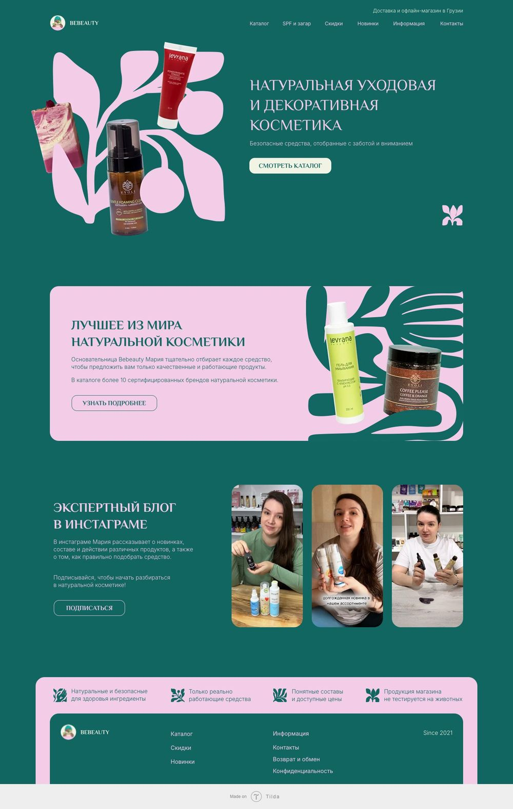
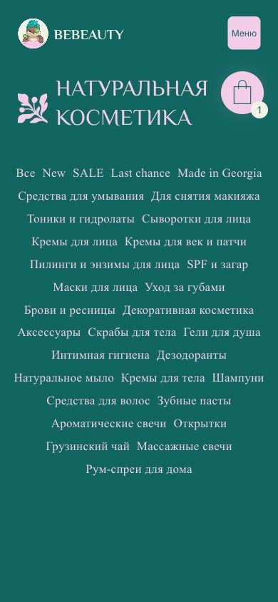
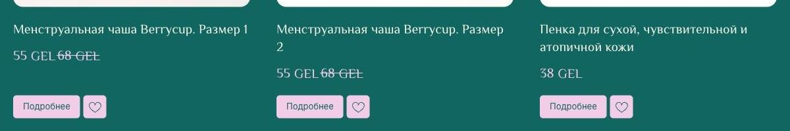
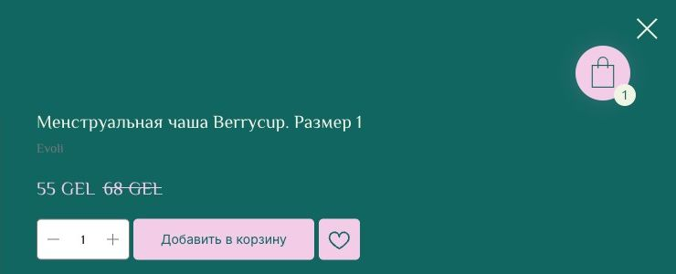
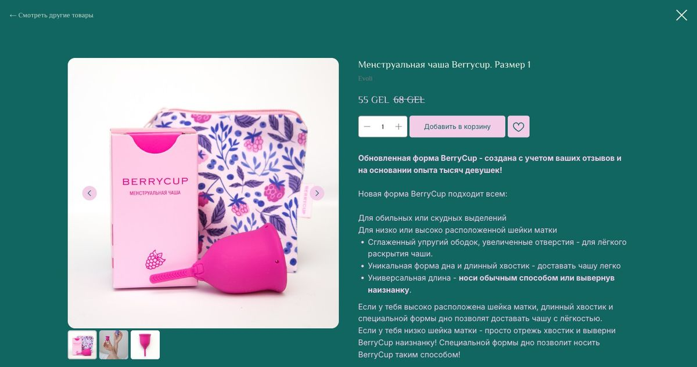
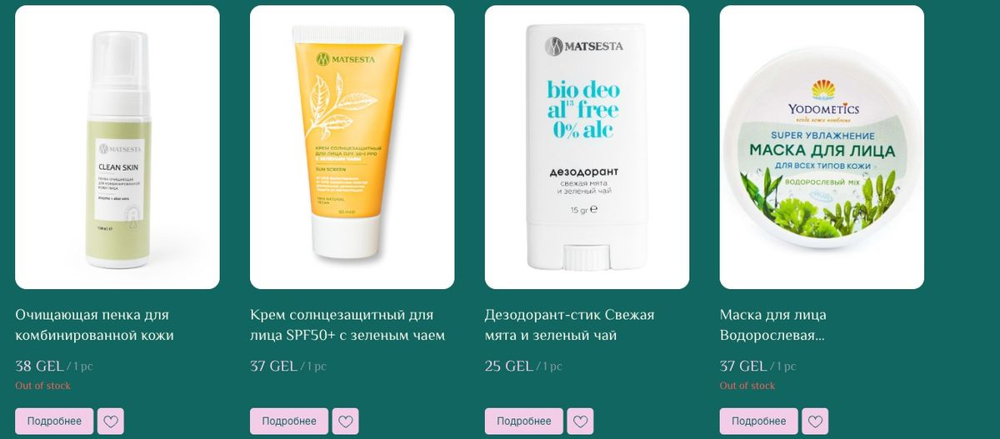
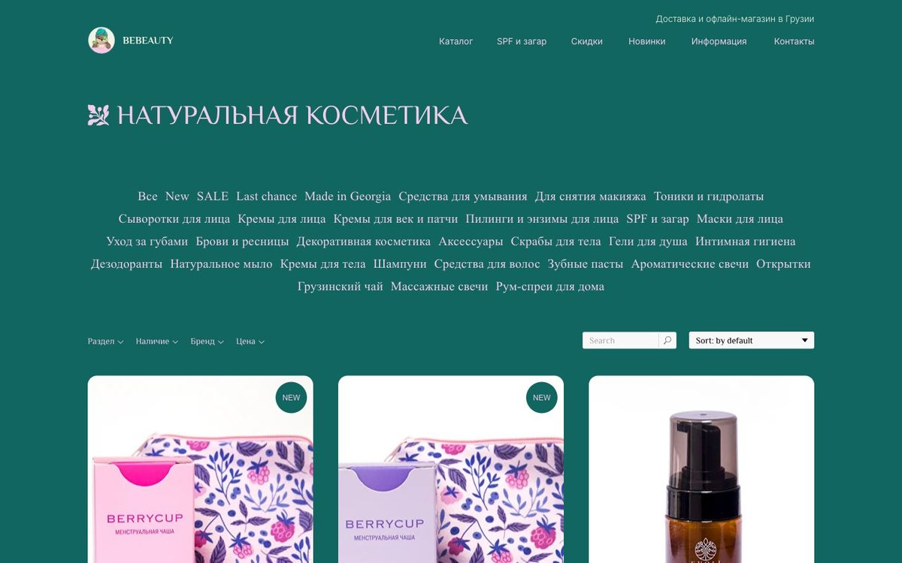
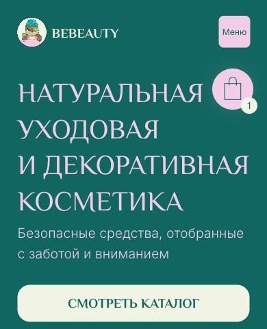
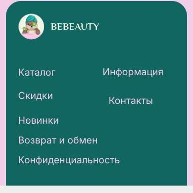
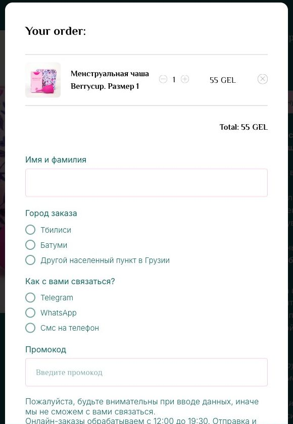

# Ревью сайта bebeauty-tbilisi.store

Дата: 2026-09-28

Сайт пройден в браузере на десктопе (1440px) и на мобильном (390px): главная, каталог, карточка товара, корзина, «Контакты» и «Информация». Товар добавлялся в корзину, заказ не оформлялся.

Полноразмерные скриншоты лежат в `full/`.

## Общее впечатление

Визуально у сайта есть характер. Тёмно-зелёный и розовый с «матиссовскими» растительными формами смотрятся живо и не похожи на шаблон. Хорошо сделан герой-блок с товарами поверх орнамента. Но как **магазин** сайт слабее, чем как визитка. Главные проблемы в том, как покупатель ищет товар и оформляет заказ, а также в мелкой небрежности, которая снижает доверие к продавцу.

## 🔴 Критичное: мешает продавать

1. **На главной нет ни одного товара.** Там три блока: герой, «о нас» и Instagram. Нет хитов, новинок, скидок и категорий. Всё, что человек может сделать с главной, это нажать «Смотреть каталог».

   

2. **На мобильном первый экран каталога полностью занят облаком из 33 категорий.** Первый товар начинается на 922px, то есть ниже первого экрана. На десктопе облако тоже выглядит тяжело. Лучше сделать горизонтальный скролл «чипсов» или сгруппировать категории: Лицо / Тело / Волосы / Макияж / Дом.

   

3. **На карточке в каталоге нет кнопки «В корзину».** Есть только «Подробнее» и сердечко, поэтому ради покупки приходится открывать каждый товар.

   

4. **Добавление в корзину почти не даёт обратной связи.** После нажатия кнопка не меняется, уведомления нет. Появляется только плавающая иконка корзины. Пока корзина пуста, этой иконки нет вообще, так что до первого добавления в шапке корзины не видно.

   

5. **В карточке товара ошибка в данных.** У менструальной чаши BerryCup указан бренд «Evoli». Такое сразу подрывает доверие. Стоит проверить бренды во всём каталоге. Сама подпись бренда почти не читается: серый текст на зелёном фоне.

   

6. **Товары «Out of stock» стоят в общей выдаче и в рекомендациях.** На первой странице каталога таких 9. В блоке «похожие товары» у чаши половина позиций нет в наличии. Их нужно отправлять в конец списка или скрывать из рекомендаций.

   

## 🟠 Визуал и типографика

- **Третий шрифт подставляется с запасного.** Облако категорий и ссылка «← Смотреть другие товары» заданы шрифтом Playfair Display, но он не загружается, и браузер показывает Times New Roman. Это и есть та «газетная» антиква в облаке категорий. В остальном на сайте Philosopher и Inter, так что это очевидный баг.

  

- **Philosopher в названиях и ценах товаров** читается хуже, чем Inter. Особенно это заметно в ценах: «12,5 GEL / 1 pc». Для чисел лучше гротеск.
- **Цена со скидкой не выделена.** Строка «55 GEL ~~68 GEL~~» склеена без отступа, новая цена того же цвета, что и обычная, бейджа «-19%» нет. Зачёркнутая цена светло-розовая и спорит с новой.

  

- **«Out of stock» красным мелким шрифтом на тёмно-зелёном фоне** плохо читается по контрасту.

  

- **Кнопки на карточке маленькие и бледные** (розовый фон, 40px в высоту) и выглядят как второстепенные.
- На мобильном **плавающая иконка корзины перекрывает заголовок H1** рядом с кнопкой «Меню».

  

- В мобильном футере **пункт «Контакты» сдвинут** относительно «Информации»: 219px против 207px.

  

- В десктопной шапке мелкий растительный значок справа внизу героя выглядит случайным.

## 🟠 Язык и тексты

- **Русский и английский перемешаны**, в основном из-за стандартных строк Tilda: «Your order:», «Total:», «Search», «Sort: by default», «Out of stock», «/ 1 pc», «New», «SALE», «Last chance». Их можно перевести в настройках магазина Tilda.

  

- **Нет переключателя языка.** При этом в `<title>` страниц есть английский («Natural cosmetics Tbilisi»), а магазин в Тбилиси. Если аудитория не только русскоязычная, нужны EN и, возможно, KA. Если только русскоязычная, английские хвосты в title не нужны.
- `<html lang="">` пустой. Это вредит SEO и экранным дикторам.
- **Описание товара — сплошная простыня.** Там смешаны маркетинг, цитата основательницы, характеристики и размеры. Лучше разбить на вкладки или аккордеон: «Описание / Состав / Применение / Характеристики».
- **Разное время работы:** онлайн-заказы обрабатываются с 12:00 до 19:30, магазин открыт с 13:00 до 20:00. Это не ошибка, но путает.

## 🟡 Оформление заказа

- **Бесплатная доставка от 90 GEL упоминается только на странице «Информация».** Её стоит показывать в шапке и в корзине с подсказкой вроде «до бесплатной доставки осталось 35 GEL». Это простой способ поднять средний чек.
- **Онлайн-оплаты нет.** Оплата идёт переводом на счёт TBC после звонка менеджера. Для небольшого магазина это допустимо, но это главный источник трения. Об этом стоит честно написать прямо в корзине, до кнопки «Оформить заказ».
- **Галочка согласия на обработку персональных данных стоит заранее**, и поле не обязательное. Юридически согласие должно быть активным: галочку ставит сам пользователь.
- В корзине нет поля адреса и не видна стоимость доставки. Итог «Total» показан без доставки.

## 🟡 Контакты и доверие

- На странице контактов **нет карты**, хотя есть офлайн-магазин. Нужна хотя бы ссылка на Google Maps.
- **В футере нет контактов**: телефона, Telegram, Instagram, адреса. Сейчас там только навигация.
- **Отзывов нет нигде.** Для натуральной косметики это важный фактор доверия.
- Сейчас на главной фраза «более 10 сертифицированных брендов». «Более 10» звучит скромно, лучше показать логотипы брендов.
- Плашка «Made on Tilda» в самом низу. Её можно убрать на платном тарифе.

## Технические мелочи

- На каждой странице в консоли 20 ошибок `<mask> attribute x: Expected length, "null"` от SVG-орнаментов. Пользователь их не видит, но это признак битой разметки фигур.
- Если открыть товар по прямой ссылке, он показывается как попап без шапки и футера: есть только крестик и «← Смотреть другие товары». Человек, пришедший из поиска или Instagram, остаётся без навигации по сайту.

## Что сделать первым

1. Добавить на главную подборки товаров (новинки, скидки, хиты) и плитку основных категорий.
2. Переделать навигацию по категориям: группы на десктопе, горизонтальный скролл на мобильном.
3. Добавить «В корзину» на карточки и заметную реакцию на добавление. Корзину показывать в шапке всегда.
4. Перевести стандартные строки Tilda на русский, починить шрифт Playfair и выделить цены со скидкой.
5. Показывать порог бесплатной доставки в шапке и в корзине.
6. Проверить бренды в карточках и отправить отсутствующие товары в конец выдачи.
